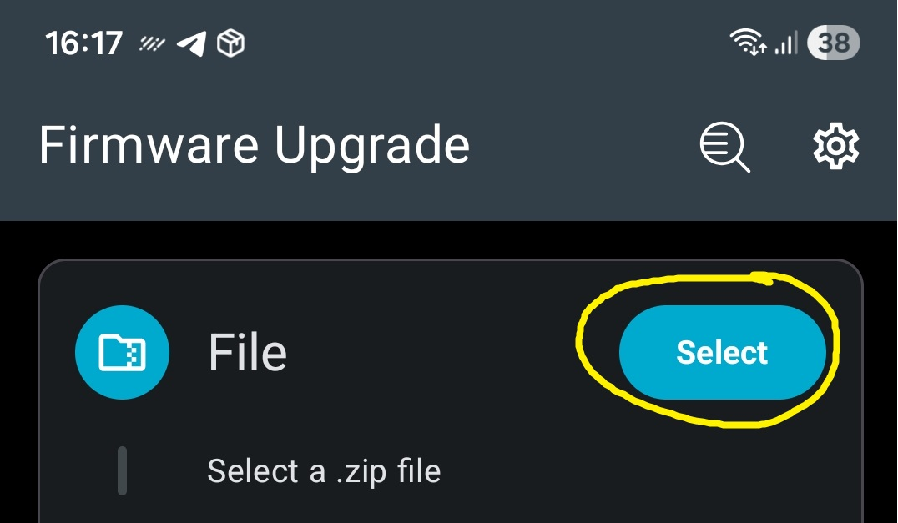
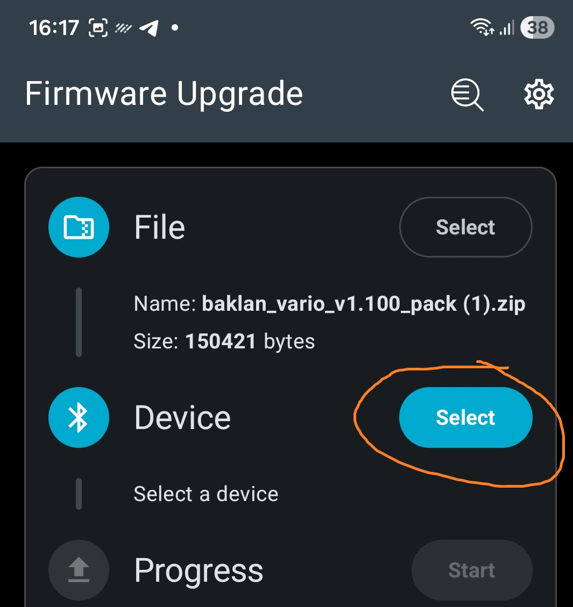
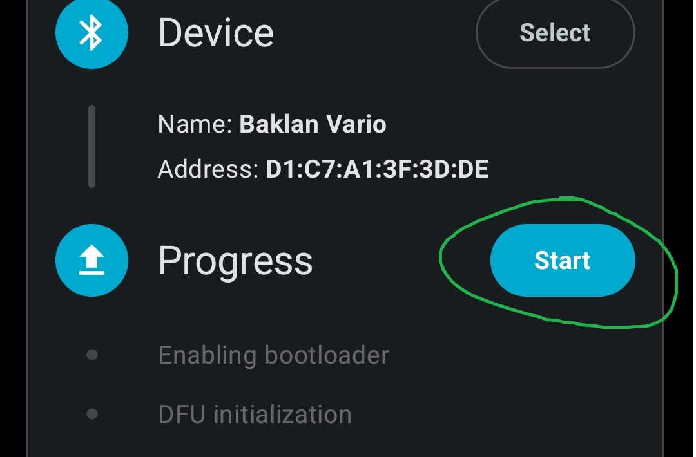

# Baklan Vario public page
# Вариометр Баклан
Software and hardware support: baklan.vario@gmail.com 
BLE vario description &amp; software releases

# Firmware update
1. Download and install nRF Device Firmware Update from playmarket
2. Download .zip package from release page of this repo
3. Start nRF Device Firmware Update
4. Select firmware .zip package 

5. Select device. Device bluetooth name will be "Baklan Vario". If last attempt of firmware update goes wrong, press and hold power button at vario **till the end of firmware update** and search for "Baklan_dfu" 

6. Press and hold power button at vario **till the end of firmware update** and press "Start" button 

7. Wait for firmware update