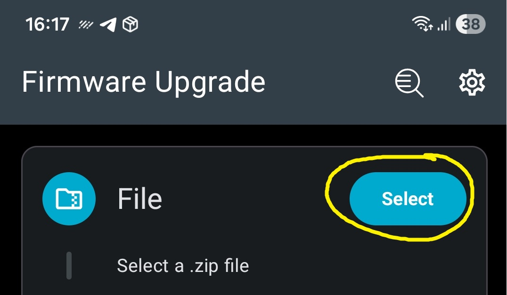
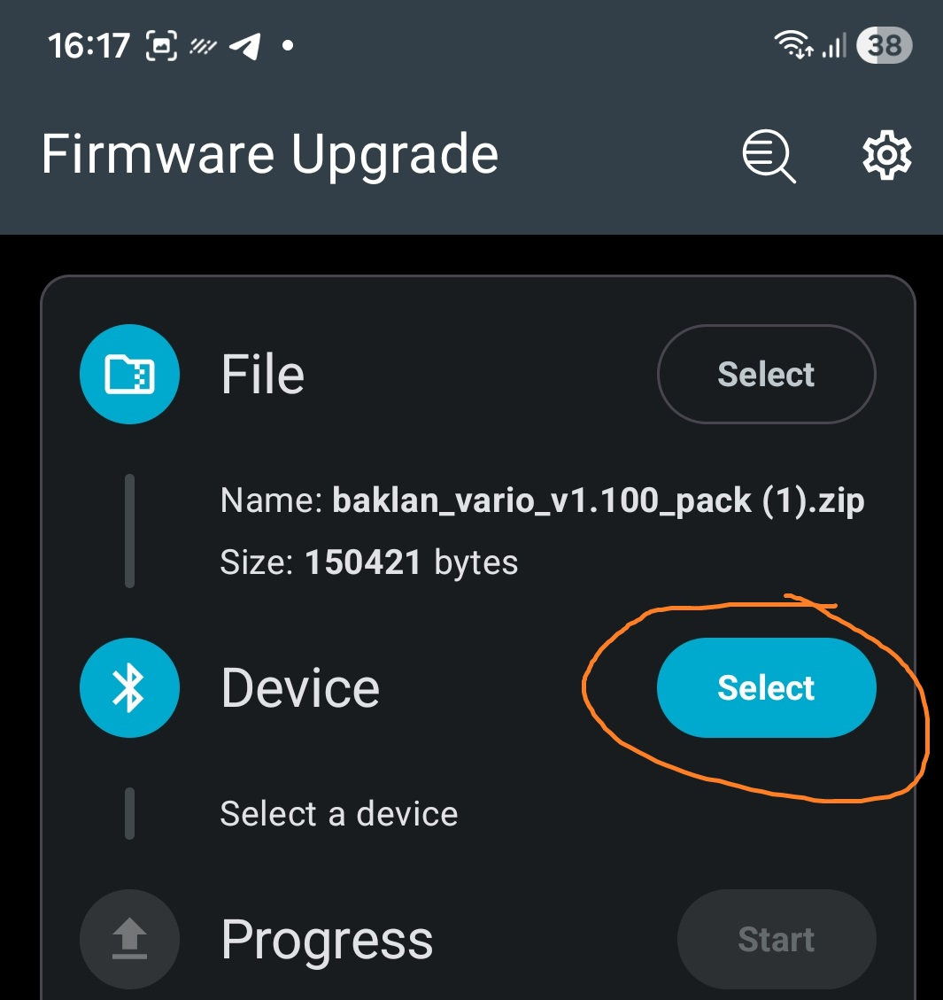
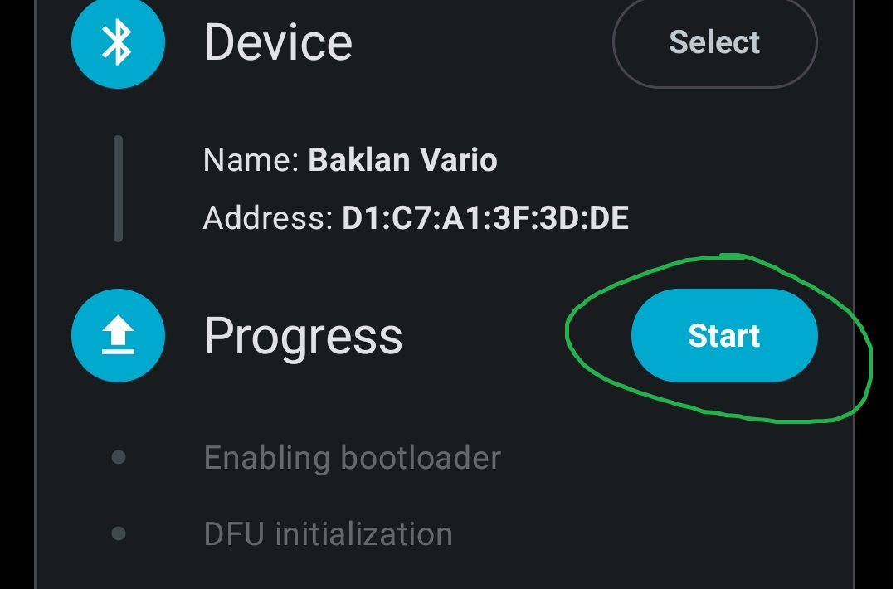

# Baklan Vario public page
# Вариометр Баклан
Software and hardware support: baklan.vario@gmail.com 
BLE vario description &amp; software releases

# Firmware update
1. Download and install nRF Device Firmware Update from playmarket
2. Download .zip package from release page of this repo
3. Start nRF Device Firmware Update
4. Select firmware .zip package 
5. Power on vario 

6. Select device. Device bluetooth name will be "Baklan Vario" 

7. Press and hold power button at vario **till the end of firmware update** and press "Start" button 

8. Wait for firmware update 

# Troubleshooting
Cannot find device: device powered off or doesnt have firmware. Try to power on device or press and hold power button and search for "BaklanDFU" device.
